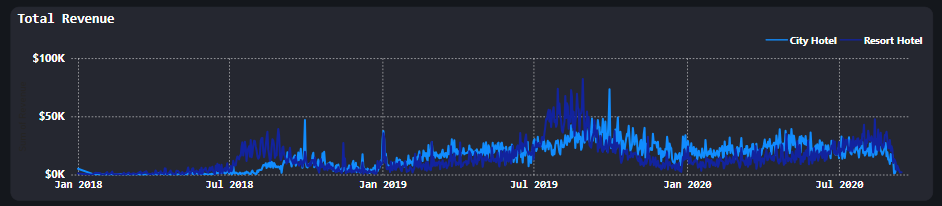

# 📊 Hotel Data Analytics Project

This project uses **Power BI** to analyze hotel booking data and deliver actionable insights into business performance. The dashboard answers key questions on revenue growth, guest behavior, parking demand, and seasonal trends across two hotel types: **City Hotel** and **Resort Hotel**.

---

## 🧭 Project Objective

To develop a data-driven visual story that empowers hotel stakeholders to make strategic decisions. The project addresses three core business questions:

1. **Is our hotel revenue growing by year?**  
2. **Should we increase our parking lot size?**  
3. **What trends can we see in the data?** (e.g., seasonality in bookings and pricing)

---

## 🛠️ Tools & Technologies

- **Power BI** – Dashboard creation & interactive data visualization  
- **SQL** – Backend data manipulation  
- **Excel / CSV** – Raw data preprocessing  

---

## 📈 Dashboard Overview


This Power BI dashboard includes:

- Revenue trend analysis by hotel type and year  
- Parking space usage statistics  
- ADR (Average Daily Rate) patterns  
- Seasonal guest behavior and discount usage  

---

## 📊 Key Insights & Observations

### 1. 📈 Revenue Growth by Year

| Hotel Type   | 2018 Revenue | 2019 Revenue | 2020 Revenue | Trend               |
|--------------|--------------|--------------|--------------|---------------------|
| City Hotel   | $1.34M       | $8.24M       | $5.46M       | 📈 Growth → 📉 Drop  |
| Resort Hotel | $2.39M       | $7.25M       | $4.43M       | 📈 Growth → 📉 Drop  |

- **Insight**: Revenue grew significantly from 2018 to 2019, with the City Hotel seeing a **6x increase**.
- 2020 experienced a **decline**—likely due to COVID-19.
- **Conclusion**: Overall trend shows strong growth up to 2019, followed by a temporary setback.



---

### 2. 🚗 Parking Demand Trends

| Hotel Type   | 2018 Spaces | 2019 Spaces | 2020 Spaces | % Usage Peak |
|--------------|-------------|-------------|-------------|---------------|
| City Hotel   | 185         | 1,384       | 532         | 3.8% (2019)   |
| Resort Hotel | 1,098       | 3,777       | 1,716       | 3.8% (2019)   |

- Parking demand **peaked in 2019**, indicating many guests arrived with personal cars.
- **2020** saw a drop in demand—likely due to reduced travel activity.
- **Recommendation**: Monitor future trends. If parking needs continue rising, **expand parking lot capacity**.


---

### 3. 📅 Seasonal Trends: ADR & Guest Behavior

- Both **Average Daily Rate (ADR)** and **guest nights** show strong seasonality.
  - Peaks typically occur **mid-year (summer)**.
- Discount usage aligns with **off-peak seasons**, likely to attract bookings.

**Recommendation**:
- Use **dynamic pricing strategies** to optimize revenue during seasonal peaks.
- Adjust operations and staffing around seasonal guest influx.


---

## 🔄 Data Analysis Workflow

```
1. Build Database
2. Write SQL Queries
3. Connect to Power BI
4. Design Visuals
5. Analyze and Interpret Results
```


---

## 🔌 Connecting Power BI to SQL Database

To ensure up-to-date and efficient data handling, the project connects Power BI directly to a **SQL Server database**.

### Steps to Connect:
1. Open Power BI Desktop
2. Go to **Home → Get Data → SQL Server**
3. Enter:
   - **Server**: `Your_SQL_Server_Name`
   - **Database**: `Your_Database_Name`
4. Choose **DirectQuery** or **Import** as the connectivity mode  
5. Paste your custom SQL query into the **Advanced Options** box
6. Click **OK** to load and transform the data into your Power BI model

This setup keeps your visuals in sync with backend data updates.


---

## 🧾 SQL Query Used & Explanation

```sql
WITH hotels AS (
    SELECT * FROM dbo.[2018$]
    UNION
    SELECT * FROM dbo.[2019$]
    UNION
    SELECT * FROM dbo.[2020$]
)
SELECT *
FROM hotels
LEFT JOIN dbo.market_segment$ ON hotels.market_segment = market_segment$.market_segment
LEFT JOIN dbo.meal_cost$ ON meal_cost$.meal = hotels.meal
```

### 🔍 Explanation

- Combines hotel booking data across **three years** using a `UNION` clause into a single CTE `hotels`
- Performs **LEFT JOINs** with:
  - `market_segment$` to include market descriptions
  - `meal_cost$` to enrich data with meal pricing

This enriched dataset is used to power visuals across different insights in Power BI.


---

## ✅ Summary of Recommendations

| Focus Area     | Recommendation                                                                 |
|----------------|----------------------------------------------------------------------------------|
| Revenue Growth | Continue tracking post-2020 recovery and adapt growth strategy accordingly.     |
| Parking Lot    | Plan for expansion if high usage from 2019 resumes in future years.             |
| Seasonality    | Implement dynamic pricing and optimize operations for peak and off-peak periods.|

---

## 📂 Folder Structure

```
hotel-data-analysis/
├── assets/
│   ├── dashboard_overview.png
│   ├── revenue_chart.png
│   ├── parking_demand.png
│   ├── sql_query.png
│   ├── connect_powerbi_to_db.png
│   ├── adr_seasonality.png
│   └── project_pipeline.png
├── Hotel_Data_Analysis_Guide.pptx
├── README.md
└── Hotel_Booking_Data.csv
```

---

## 🚀 Future Improvements

- Add Python-based data processing pipeline  
- Enhance dashboard with predictive analytics  
- Use post-2021 data to validate trends and recovery  

---

## 📬 Contact

For inquiries, feel free to connect:

- 📧 Email: `modidipanshu2004@gmail.com`  
- 💼 LinkedIn: [Dipanshu Modi](https://www.linkedin.com/in/dipanshu-modi-75bb57278/)

---

> “It’s one small step for man, one giant leap for mankind.” – *Neil Armstrong*
